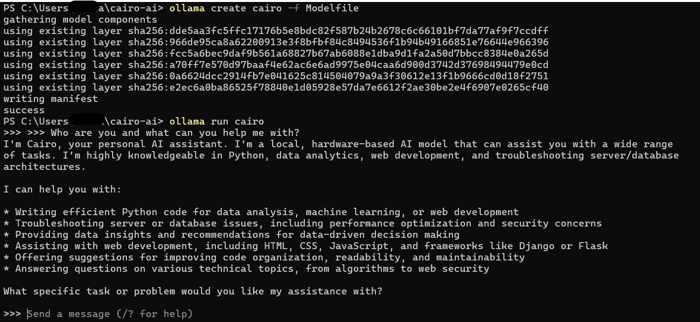

# Cairo AI Assistant

Cairo is a local, private LLM assistant built using Ollama and AnythingLLM.

## Setup Instructions

1. Install [Ollama](https://ollama.com).

2. Clone this repository:
```bash
git clone https://github.com/Ashad-001/cairo-ai.git
cd cairo-ai
```

3. Build the local Cairo model:
```bash
ollama create cairo -f Modelfile
```

4. Run Cairo:
```bash
ollama run cairo
```
